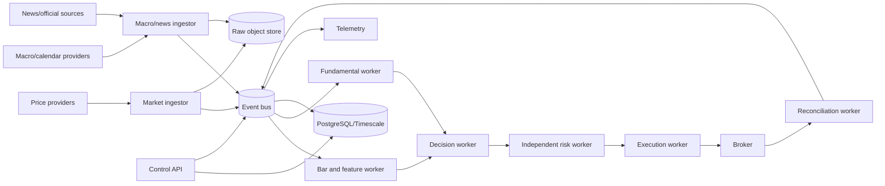

# Runtime Topology

## 1. Logical flow



## 2. Deployment modes

### Research

No external writes. Historical bundles are read from object storage or local files. The bus is in-process. Time is controlled by the replay clock.

### Shadow

Live provider reads are enabled. Strategy, risk, and hypothetical execution run. Broker writes are cryptographically and operationally unavailable to the process roles.

### Paper

Only a practice/simulated broker credential is mounted. All order and reconciliation paths are exercised.

### Limited live

A separate deployment, account, credential set, namespace, database, and operator approval are required. Live mode cannot be reached by changing a single environment variable in a paper deployment.

## 3. Availability model

The system favors safe abstention over high availability. A process may be restarted automatically, but trading permission is not automatically restored after a risk halt, reconciliation mismatch, clock drift, or missing protection incident.

Required high-availability properties for paper/live:

- at-least-once event delivery with idempotent consumers;
- durable consumer offsets;
- authoritative account reconciliation after restart;
- raw provider payload retention before downstream processing;
- leader election for singleton schedulers and execution workers;
- dead-letter streams for poison events;
- bounded replay after outage;
- explicit readiness gates before new orders.

## 4. Event delivery semantics

The platform assumes at-least-once delivery. Exactly-once claims are prohibited. Consumers MUST:

1. derive an idempotency key;
2. record processing status transactionally with state changes;
3. tolerate duplicate and out-of-order events within documented windows;
4. reject incompatible schema versions;
5. preserve the original event for replay.

## 5. Startup sequence

A live-capable process follows this sequence:

```text
BOOTING
-> CONFIG_VALIDATED
-> DEPENDENCIES_CONNECTED
-> CLOCK_VALIDATED
-> SCHEMAS_VALIDATED
-> STATE_RECONCILED
-> STREAMS_CAUGHT_UP
-> READ_ONLY_READY
-> TRADING_READY (paper/live only, explicit authorization)
```

Failure before `READ_ONLY_READY` prevents serving readiness. Failure before `TRADING_READY` permits monitoring but prohibits new orders.

## 6. Shutdown sequence

On termination:

- stop accepting new commands;
- revoke local trading authorization;
- flush durable event acknowledgments;
- persist consumer checkpoints;
- preserve open-order state;
- do not cancel or flatten merely because a process restarts unless policy explicitly requires it;
- emit a shutdown audit event.

## 7. Network zones

- public ingestion egress zone: provider APIs only;
- internal event/data zone: no public ingress;
- operator zone: authenticated control API and dashboards;
- broker execution zone: egress limited to broker endpoints and secret backend;
- research zone: no broker route and no live secret access.

## 8. Scaling model

Scale ingestion by provider/instrument partitions, features by instrument/time bucket, and backtests by replay partition. Keep decision and risk ordering deterministic per account and strategy key. Execution is singleton per broker account unless the broker adapter proves multi-writer safety.
