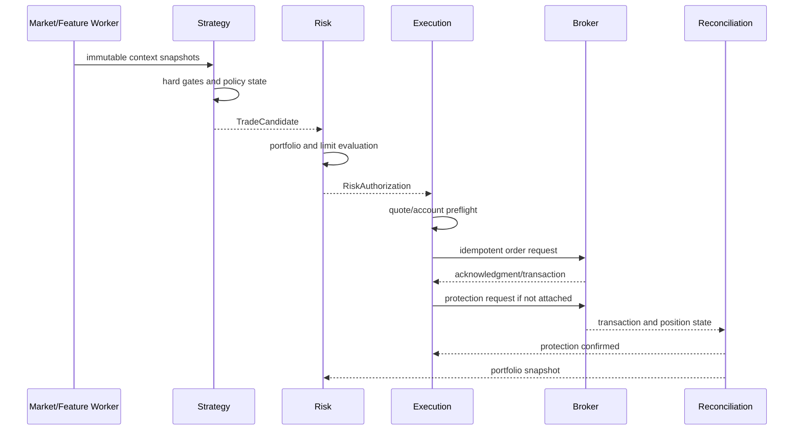
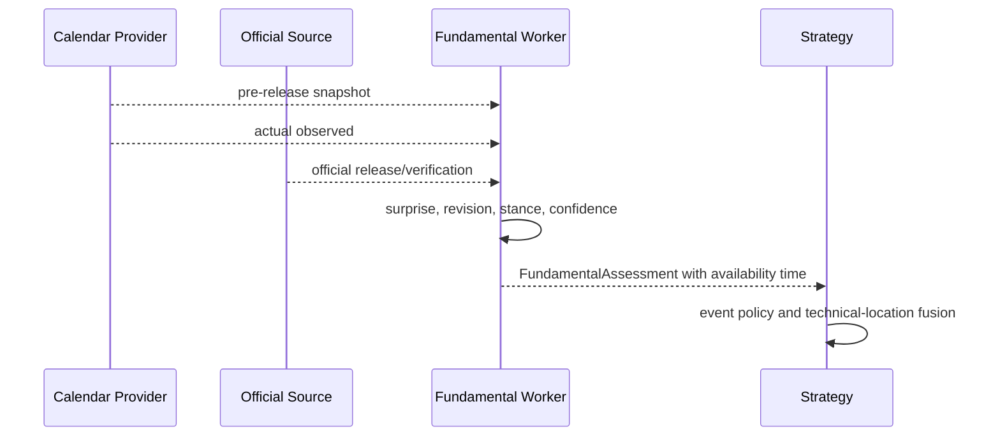

# Sequence Flows

## Candidate to protected position



## Timeout after submission

```mermaid
sequenceDiagram
  participant E as Execution
  participant B as Broker
  participant C as Reconciliation
  E->>B: order with client ID
  B--xE: HTTP timeout
  E->>E: state = UNKNOWN; block retry
  E->>B: query order/client ID and transactions
  B-->>C: authoritative fill/order state
  C-->>E: resolved ACK/FILL or no order
  E->>E: continue lifecycle or retry same ID
```

## Economic release


