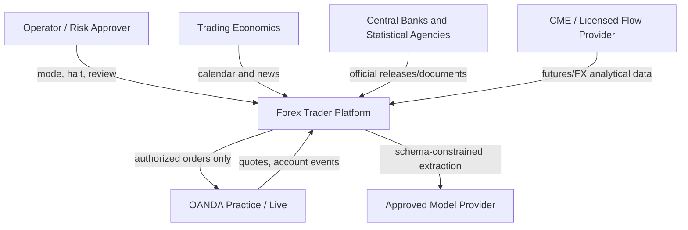
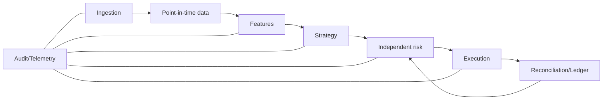

# System Context Diagrams

## Context

```mermaid
flowchart TB
  OP[Operator / Risk Approver]
  BOT[Forex Trader Platform]
  OAN[OANDA Practice / Live]
  TE[Trading Economics]
  OFF[Central Banks and Statistical Agencies]
  CME[CME / Licensed Flow Provider]
  MOD[Approved Model Provider]
  OP -->|mode, halt, review| BOT
  OAN -->|quotes, account events| BOT
  BOT -->|authorized orders only| OAN
  TE -->|calendar and news| BOT
  OFF -->|official releases/documents| BOT
  CME -->|futures/FX analytical data| BOT
  BOT -->|schema-constrained extraction| MOD
```

## Domain boundaries

```mermaid
flowchart LR
  ING[Ingestion] --> DATA[Point-in-time data]
  DATA --> FEAT[Features]
  FEAT --> STRAT[Strategy]
  STRAT --> RISK[Independent risk]
  RISK --> EXEC[Execution]
  EXEC --> REC[Reconciliation/Ledger]
  REC --> RISK
  ALL[Audit/Telemetry] --- ING
  ALL --- FEAT
  ALL --- STRAT
  ALL --- RISK
  ALL --- EXEC
```
